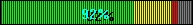



## LEDProgress Bar 1\.1

### Description

NOW WITH MAX AND MIN PROPERTIES!! This is a simple horizontal progress bar with yellow and red zones. The zones can be changed and values must be within 100. If you don't want any zones at all and just want green, just set the yellow and red to 100. Still working on a more visible label for the center, otherwise not bad. PLEASE VOTE NO MATTER WHAT YOU THINK.
 
### More Info
 
Max as Integer

Min as Integer

Value as Integer

Red as Integer

Yellow as Integer

Appearance as Integer

             |
---                |---
**Submitted On**   |2002-09-03 09:48:20
**By**             |[James W\. Manning](https://github.com/Planet-Source-Code/PSCIndex/blob/master/ByAuthor/james-w-manning.md)
**Level**          |Intermediate
**User Rating**    |4.1 (41 globes from 10 users)
**Compatibility**  |VB 5\.0, VB 6\.0
**Category**       |[Custom Controls/ Forms/  Menus](https://github.com/Planet-Source-Code/PSCIndex/blob/master/ByCategory/custom-controls-forms-menus__1-4.md)
**World**          |[Visual Basic](https://github.com/Planet-Source-Code/PSCIndex/blob/master/ByWorld/visual-basic.md)
**Archive File**   |[LEDProgres126009932002\.zip](https://github.com/Planet-Source-Code/james-w-manning-ledprogress-bar-1-1__1-30528/archive/master.zip)

